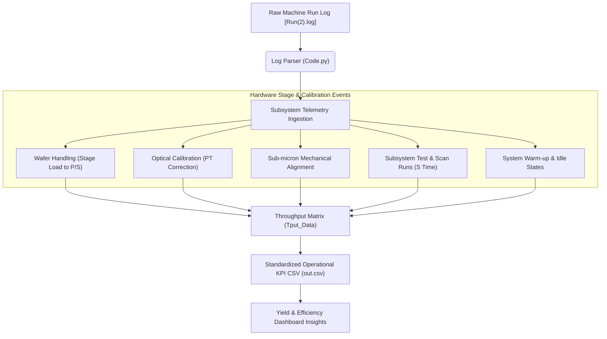

# 📊 Semiconductor Machinery Throughput Analytics (Log-Reader)

> **Product Showcase Repository:** Validating telemetry ingestion requirements and machine state transitions for high-precision B2B hardware-software integrations.

---

## 💡 The Product Concept

In advanced manufacturing and semiconductor environments (e.g., lithography, metrology, and inspection), system uptime and **wafer-per-hour (WPH) throughput** are primary revenue drivers. However, low-level machine controller logs are highly complex, generating millions of lines of unstructured event telemetry.

This project is a functional diagnostic utility that parses raw machine telemetry (`Run(2).log`), maps the physical hardware states, and aggregates them into structured, human-readable operational KPIs. 

By translating low-level step execution times (like optical stage alignment and substrate loading) into standardized metrics, this utility bridges the gap between hardware engineering diagnostic data and executive manufacturing productivity dashboards.



---

## 📈 PMT Alignment: Telemetry to Business Value

From a **Product Management Technical (PMT)** perspective, this parser demonstrates the execution of critical data-logging and performance requirements:

* **SLA & Uptime Verification:** Extracts exact start-to-finish durations for sub-micron stage movements, ensuring physical hardware complies with contractual design specifications.
* **Bottleneck Diagnostic Modeling:** Computes step-level performance indicators (e.g., *Align Time* vs. *Scan/Test Time*) to pinpoint whether software latency or mechanical overhead is limiting wafer throughput.
* **Customer Value Translation:** Packages raw diagnostic event codes into clean, standard formats (`out.csv`), ready to feed into MES (Manufacturing Execution Systems) or customer yield-management databases.

---

## ⚙️ Key Telemetry Features & Mappings

The parser scans raw telemetry line-by-line, matching key mechanical states and measuring their execution boundaries:

| Mechanical Phase / Telemetry Event | Raw Log Marker | PMT Business KPI Managed |
| :--- | :--- | :--- |
| **Lot / Session Start** | `HEADER` | Session Initialization Timestamp |
| **Substrate Stage Loading** | `load to p time = ` / `load from p to s time =` | Material Handling Overhead & Stage Transit Uptime |
| **Precision Subsystem Calibration** | `PT Correction Start` / `PT Correction Complete` | System Drift Correction & Physical Alignment Quality Control |
| **Sub-micron Alignment** | `Align time = ` | Mechanical Settling & Optics Target Alignment Latency |
| **Subsystem Test & Scanning** | `S Time: ` / `Time per wi = ` | Active Inspection Run-rate & Core Imaging Performance |
| **System Thermal Stabilizing** | `wu time =` | Thermal Settling Overhead / Machine Productive vs. Non-productive Uptime |
| **Lot / Session End** | `L Done` | Complete Cycle Run-Time Verification |

---

## 🚀 Execution & Verification

### Technical Stack
* **Runtime:** Python 3.x
* **Dependencies:** Standard Library (`csv`, `numpy` for scientific telemetry data modeling)
* **Input/Output:** Raw ASCII machine logs (`Run(2).log`) $\rightarrow$ Relational CSV manifest (`out.csv`)

### How to Run
To parse a machine log run locally:
1. Ensure your run log is named `Run(2).log` in the root of the project directory.
2. Run the ingestion utility:
   ```bash
   python Code.py
   ```
3. A standardized `out.csv` will be generated in the root directory, detailing each step execution phase, phase name, and captured duration.
